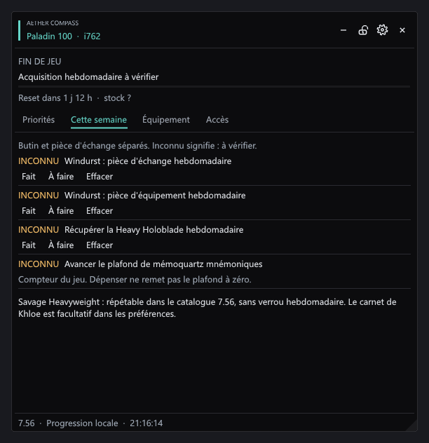

# Aether Compass

**Choisir son prochain objectif en Éorzéa.** Plugin Dalamud en français, conçu pour les nouveaux niveaux 100, le rattrapage d'équipement et la progression en fin de jeu.

Aether Compass croise le niveau réel du job, les pièces équipées, les quêtes d'épopée, les accès aux contenus et le plafond hebdomadaire de mémoquartz. Il propose des objectifs classés et explique leurs prérequis, leur intérêt et les données qui restent à vérifier.

Le panneau s'inspire de **LMeter** : fond anthracite translucide, en-tête intégré, accent discret et lignes compactes. Les six premières priorités sont visibles en lecture rapide ; cliquer sur une ligne affiche ses raisons et prérequis. L'en-tête permet de déplacer, replier, verrouiller et fermer le panneau. L'engrenage ouvre les préférences dans le même panneau.

**Version 0.1.0 expérimentale — Dalamud API 15, catalogue patch 7.56.** Compilation et tests hors jeu ; comportement en jeu à confirmer. L'analyse porte sur le personnage connecté. Les quêtes, monnaies et weekly des autres joueurs ne sont pas accessibles à ce plugin.


*Interface ImGui réelle rendue hors jeu, avec un personnage fictif. Ce n'est pas une capture FFXIV.*

## Ce que propose le plugin

- Objectifs adaptés au palier : épopée, rattrapage i750–770, donjons Expert, Heavyweight normal, alliance Windurst, Extrême, Savage ou relique.
- Lecture du niveau réel du job, même lorsque son acteur est synchronisé en instance.
- Comparaison des récompenses avec les emplacements concernés : une arme ne corrige pas une bague faible. L'iLvl ne remplace pas un calcul de statistiques ou de BiS.
- Suivi distinct des mémoquartz gagnés cette semaine et du stock disponible.
- Récompenses d'alliance suivies séparément : équipement et pièce d'échange. La Heavy Holoblade normale possède aussi son suivi propre.
- États **fait**, **à faire**, **inconnu**, avec priorité aux données lues en jeu. Les droits de butin non lus se renseignent manuellement ; un clear ne coche pas automatiquement le loot.
- Déclarations sauvegardées par personnage. Les activités hebdomadaires expirent au mardi 08:00 UTC ; les quotidiennes à 15:00 UTC. Au nouveau cycle, une déclaration passée redevient inconnue.
- Préférences de difficulté, temps de session, priorité équipement/histoire/hebdomadaire et carnet de Khloe facultatif.

L'interface reste fermée au chargement. Ouvrir et déplier avec **`/goals`** ou **`/aethercompass`** ; **`/aethercompass weekly`** ouvre le suivi hebdomadaire. Le verrouillage empêche seulement le déplacement et le redimensionnement ; les boutons restent actifs. Les lectures sont suspendues en combat, pendant les cinématiques et les changements de zone.

## Installer la préversion

1. Télécharger et extraire le ZIP de la [préversion](https://github.com/Aleqsd/aether-compass/releases).
2. Conserver ensemble `AetherCompass.dll`, `AetherCompass.Core.dll`, `AetherCompass.deps.json` et `AetherCompass.json`.
3. Dans les réglages Dalamud, onglet expérimental, ajouter le **chemin complet de `AetherCompass.dll`** aux *Dev Plugin Locations*.
4. Activer Aether Compass dans les plugins de développement, puis saisir `/goals`.

Le dépôt personnalisé commun d'Aleqsd n'est pas modifié par cette première préversion. Elle n'est pas soumise au catalogue officiel Dalamud.



*Les états inconnus demandent une vérification ; ils ne sont jamais assimilés à « à faire ».*

## Compiler et vérifier

Installer le SDK .NET 10 et disposer des bibliothèques Dalamud API 15, puis :

```powershell
./build.ps1 -DalamudHome "$env:APPDATA/XIVLauncher/addon/Hooks/dev"
```

Le script compile le plugin, exécute les tests métier et crée `releases/AetherCompass-0.1.0.zip` avec ses empreintes. Accepte aussi `-Dotnet` pour un SDK portable.

Les tests du moteur n'ont pas besoin du jeu ou de Dalamud :

```powershell
dotnet run --project tests/AetherCompass.Core.Tests.csproj -c Release
```

## Données et maintenance

Aucun service distant, compte supplémentaire ou clé API. Le plugin ne lance aucune action en jeu. Les préférences et déclarations restent dans la configuration locale Dalamud. Un fichier de progression illisible est conservé ; les nouvelles modifications utilisent un fichier de récupération séparé.

Les paliers et restrictions sont versionnés dans `src/Core/ObjectiveCatalog.cs`. Ils ont été vérifiés dans les notes officielles 7.4 à 7.56 ; il faut les revalider après les mises à jour. La lecture dynamique du plafond et des accès n'actualise pas à elle seule toutes les règles de récompense.

[Sources du contenu](docs/CONTENT-SOURCES.md) · [Couverture des données](docs/DATA-COVERAGE.md) · [Validation et limites](docs/VALIDATION.md)
